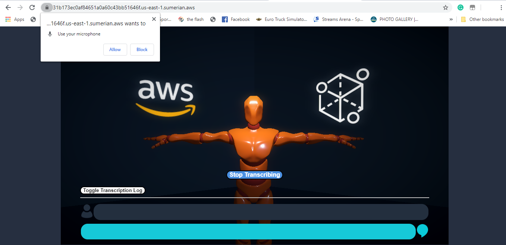
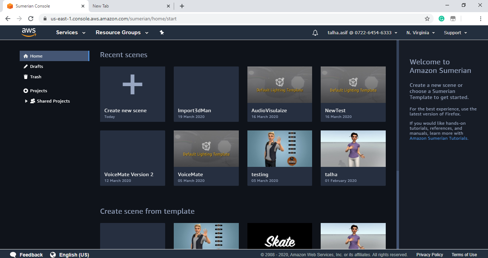
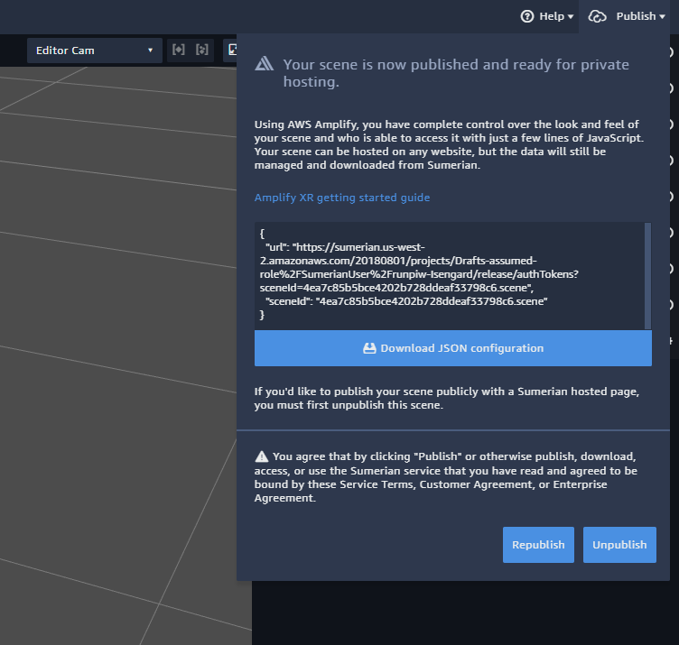

# VoiceMate

## What is it?

VoiceMate is an application that converts voice into sign language and vice versa.

The Voice to sign part was done using these aws services & technologies

- Amazon Sumerian
- Amazon Transcribe
- Amazon Polly
- Amazon Cognito
- AWS CloudFormation
- Amplify
- Ionic
- React

## How to use VoiceMate?

This scene can be viewed in the following way after you have created your own scene.


Once the scene loads it will ask you to allow for microphone access.



Then you click on the start transcribing button.
Then through your microphone speak any sentence it will display your sentence on the screen and then convert into sign language.

.png)

You can also view your transcription log by clicking on the Toggle transcription Button


## Integration

The best thing about amazon Sumerian is that these scenes can be easily integrated with a wide range of technologies in your web and mobile application.
Follow these steps to Integrate Voice mate in your applications and customize it and build upon it.
Log into you Aws account or if you don’t have one you can easily create it [here](https://aws.amazon.com/resources/create-account/)


Once you are in the console, go to services and search for Amazon Sumerian.


When the Sumerian editor loads click on create new scene.



Enter a name for your scene then hit enter then it will take you to the Sumerian Editor.


In the editor click on import asset and upload this [file](https://github.com/gray-guy/AWS_VoiceMate/blob/master/Voice_To_Sign/VoiceMate-bundle.zip)


After you import the bundle then you need to add Cognito Id. You can create one by clicking [here](https://console.aws.amazon.com/cloudformation/home?region=us-east-1#/stacks/quickcreate?templateURL=https:%2F%2Fs3.amazonaws.com%2Fsumerian-cfn-templates%2FTranscribeStreamingLexPollyExampleTemplate.yml&stackName=AmazonSumerianTrascribeStreamingStack)


Copy the Cognito Id that you generated and paste it into the Sumerian scene.

 
 
Add the Cognito id in your scene...


Once you’re done with setting up the CloudFormation stack, importing the bundle and setting up the Cognito ID. You will be presented with the following scene.


There are two main entities in this scene:

-	The HTML entity labeled “AudioTranscription”
-	The 3D character model

### AudioTranscription

The scripts on this component handle the audio transcription to text. 
  
### Character Pack

The 3d model in the scene has an animation component attached and has all the states linked to its respective animation clips. The model along with the animations were created in Blender, a popular 3D modelling software. Any other software can be used as well.
The 3d model also has a script component attached. The “AnimationScript” handles all the logic to play animations based on the transcribed text.


Once you are done modifying the scene then you have to publish it ,choose Publish in the upper-right corner, and then choose Host privately.


The scene will be published for private view. It generates a JSON config file for you to embed in your Amplify app.

 
Choose Download JSON configuration. This downloads the JSON config file named sumerian_exports_ sceneId.json. Remember where you save this file because later you are going to need it.

Ok to you use this scene in an application you are going to use Aws Amplify. So, you need to set up the CLI first.

```
npm install -g @aws-amplify/cli
```
 
Once the CLI is installed then you need to configure it

```
amplify configure
```
 
It will ask you to provide information related to your aws account. Enter all the information and amplify will be installed on your computer.
The amplify team has done a pretty good job in creating the documentation. Click [here](https://aws-amplify.github.io/docs/cli-toolchain/quickstart?sdk=js) to find out more.

Once you have installed aws amplify on your computer we are ready to integrate this scene into your application.

First you need to download & install NodeJS on your computer. You can download it from [here](https://nodejs.org/en/download/)

We are going to use ionic and react to create our application.

Install ionic with this command.

```
npm install -g @ionic/cli
```
When the installation finish creates a new ionic application.

```
ionic start MySummerianApp blank --type=react
```
It will take a few minutes to create your new project. When the project is created go inside the project folder and install amplify inside this project.

```
cd MySumerianApp
```

```
npm install aws-amplify aws-amplify-react --save
```
Then initialize amplify in your project. 
```
amplify init
```


After the initialization enter the following command.  

```
Amplify add xr
```
After configuration of the Sumerian in your app type the following command.

```
amplify push
```
After you are done with all the configuration Open your project with Visual studio code.
 
Replace home.tsx file with the following code.

```
import { IonContent, IonHeader, IonPage, IonTitle, IonToolbar } from '@ionic/react';
import React from 'react';
import ExploreContainer from '../components/ExploreContainer';
import './Home.css';
import { SumerianScene } from 'aws-amplify-react';
import Amplify from 'aws-amplify';
import Aws_exports from '../aws-exports';
import AWS from 'aws-sdk';


new AWS.Polly();
Amplify.configure(Aws_exports);

const Home: React.FC = () => {
  return (
    <IonPage>
       <IonContent>
      <div style={ { height: '100vh' } }>
    <SumerianScene sceneName='MyScene'/>
  </div>
  </IonContent>
    </IonPage>
  );
};

export default Home;

```
Then test your application with the following command.

 ```
 ionic serve
 ```

And you will get this in your application.
You can further modify your app and make changes as you like. This was a tutorial that showed how you can use voice mate in your mobile or web application.

## Pricing

As part of the AWS Free Tier, you can get started with Amazon Sumerian for free. Upon sign-up, new customers can create up to a 50MB published scene that receives the equivalence of 100 views (5GB) per month, for the first 12 months.

You are charged for the total size of the 3D assets you upload and store in Sumerian at the rate of $0.06 per GB per month.

[Amazon Sumerian Pricing](https://aws.amazon.com/sumerian/pricing/)

## References

The tutorial to add the Sumerian scene into react application.
https://docs.sumerian.amazonaws.com/tutorials/create/intermediate/amplify-react-2/

The tutorial upon which we built our scene that explains how to use amazon transcribing service.
https://docs.sumerian.amazonaws.com/articles/hands-free-voice-transcription/

To solve any problem related to creating ionic application.
https://ionicframework.com/docs
