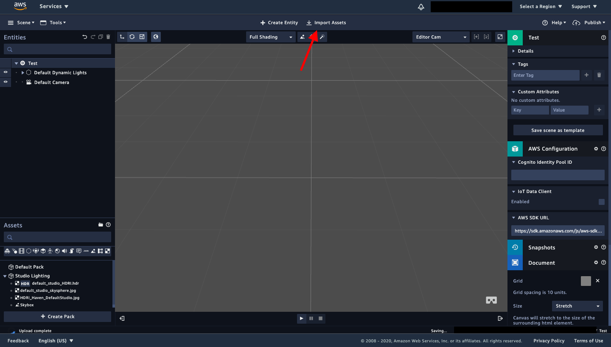
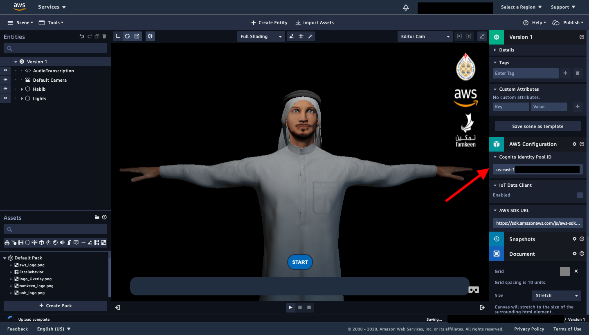
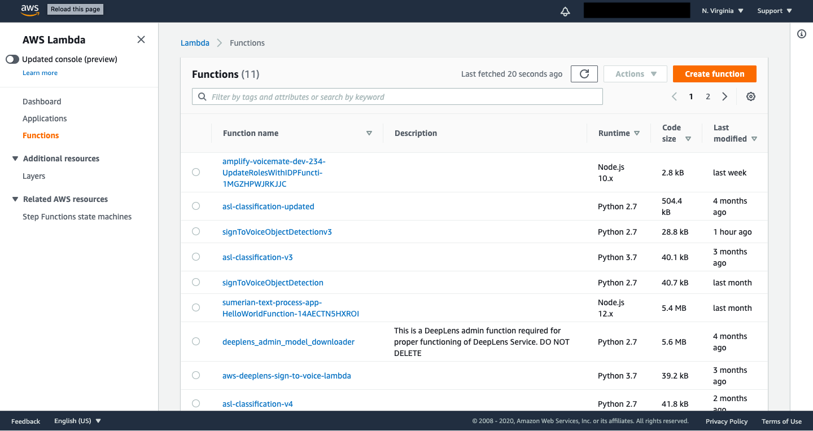
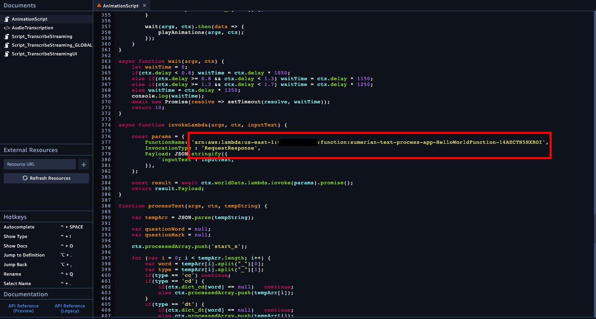
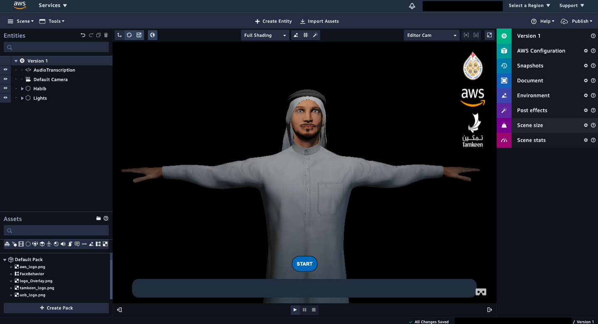
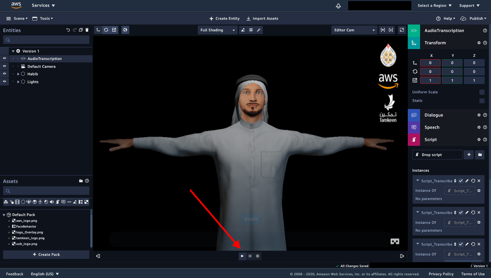
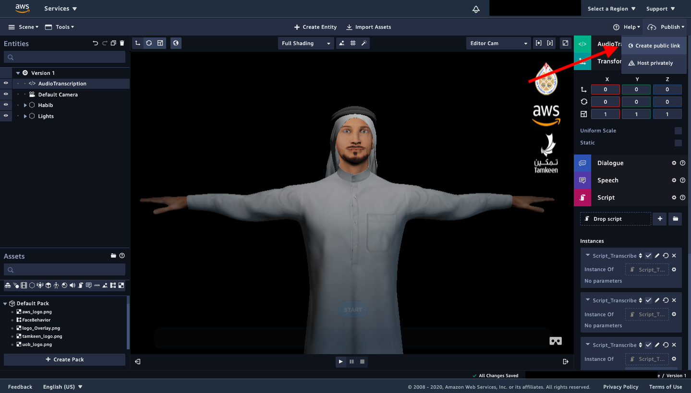

# VoiceMate

## What is it?

VoiceMate is an application that converts voice into sign language using Aws services.

The Voice to sign part was done using these aws services & technologies

- Amazon Sumerian
- Amazon Transcribe
- Amazon Polly
- Amazon Cognito
- Amazon CloudFormation
- Amazon Lambda

## This is what you will have by the end of this tutorial

## How to create the scene ?

First you need to log into you Aws account or if you don’t have one you can easily create it [here](https://aws.amazon.com/resources/create-account/). It is very simple and super fast to create an AWS account.

Once you are in the AWS console, go to services and search for Amazon Sumerian.

When the Sumerian editor loads click on create new scene.

Enter a name for your scene then hit enter then it will take you to the Sumerian Editor.

In the editor click on import asset and upload this [file](https://github.com/bahrain-uob/VoiceMate/blob/master/VoiceMate_v1.1_Bundle.zip).

After you import the bundle then you need to add Cognito Id. You can create one by clicking [here](https://console.aws.amazon.com/cloudformation/home?region=us-east-1#/stacks/quickcreate?templateURL=https:%2F%2Fs3.amazonaws.com%2Fsumerian-cfn-templates%2FTranscribeStreamingLexPollyExampleTemplate.yml&stackName=AmazonSumerianTrascribeStreamingStack).

Click on Create Stack

This stack is an AWS CloudFormation template that will spin up the required resources to get you up and running quickly. The AWS CloudFormation template will do the following:

- Create an Amazon Cognito identity pool with IAM (Identity and Access Management) policies for Amazon Lex, Amazon Polly, and Amazon Transcribe streaming transcription.

- Output the Cognito identity pool ID

Copy the Cognito Id that you generated and paste it into the Sumerian scene.

 
 
Add the Cognito id in your scene...

After that download the lambda function file by clicking [here](https://github.com/bahrain-uob/VoiceMate/blob/master/sumerian-text-process-function.zip).

Go to the Aws [lambda console](https://console.aws.amazon.com/lambda/home?region=us-east-1#/functions).

Click on Create function 

Keep the default setting and give any name to your function.

Then click on create function.

In the Function code section, expand the Code entry type drop-down list, and then choose Upload a .ZIP file.

After you have uploaded the zip file successfully, copy the ARN number.

Go back to the sumerian editor. First in the entities pannel click on the character and then in the script pannel click on the edit scipt icon (pencil icon).

It will open a new window. In the animation script replace the highlighted code with the ARN number that you copied in the previous step while creating the lamba function.

After you have changed it. Save and close the text editor.

# The Scene

Once you’re done with setting up the CloudFormation stack, importing the bundle, creating a lambda function and setting up the Cognito ID. You will be presented with the following scene.

There are two main entities in this scene:

-	The HTML entity labeled “AudioTranscription”
-	The 3D character model

### AudioTranscription

The scripts on this component handle the audio transcription to text. 
  
### Character Pack

The 3d model in the scene has an animation component attached and has all the states linked to its respective animation clips. The model was purchased and animations were created in Blender, a popular 3D modelling software. Any other software can be used as well.

The 3d model also has a script component attached. The “AnimationScript” handles all the logic to play animations based on the transcribed text.

# How to use it?

Click on the play button to start the scene.

Then click on the start button.

For the demo purposes the scene only converts the following paragraph to sign lanaguage.

>Coronavirus disease is an infectious disease caused by a newly discovered coronavirus.
>
>Most people infected with the corona virus will experience mild to moderate respiratory illness and recover without requiring special treatment.
>
>The best way to prevent and slow down transmission is be well informed about the corona virus, the disease it causes and how it spreads.
>
>Protect yourself and others from infection by washing your hands or using an alcohol based rub frequently and not touching your face.
>
>At this time, there are no specific treatments for corona virus. However, there are many ongoing clinical trials evaluating potential treatments.

You can test it out by reading the paragraph.

The scene will take the audio input and then convert into the sign language.

You can also make changes to the scene according to your own needs. Once you are done modifying the scene then you have to publish it ,choose Publish in the upper-right corner, and then choose create public link.

With the link that is generated you can view and interact with the scene on the web across any supported browser/device.

## Pricing

As part of the AWS Free Tier, you can get started with Amazon Sumerian for free. Upon sign-up, new customers can create up to a 50MB published scene that receives the equivalence of 100 views (5GB) per month, for the first 12 months.

You are charged for the total size of the 3D assets you upload and store in Sumerian at the rate of $0.06 per GB per month.

For more info check out [Amazon Sumerian Pricing](https://aws.amazon.com/sumerian/pricing/).

## References

The feature of amazon transcribing service was added using this [tutorial](https://docs.sumerian.amazonaws.com/articles/hands-free-voice-transcription/).

The 3D model was purchased from [here](https://www.turbosquid.com/3d-models/arab-man-rigged-max/1037750).
